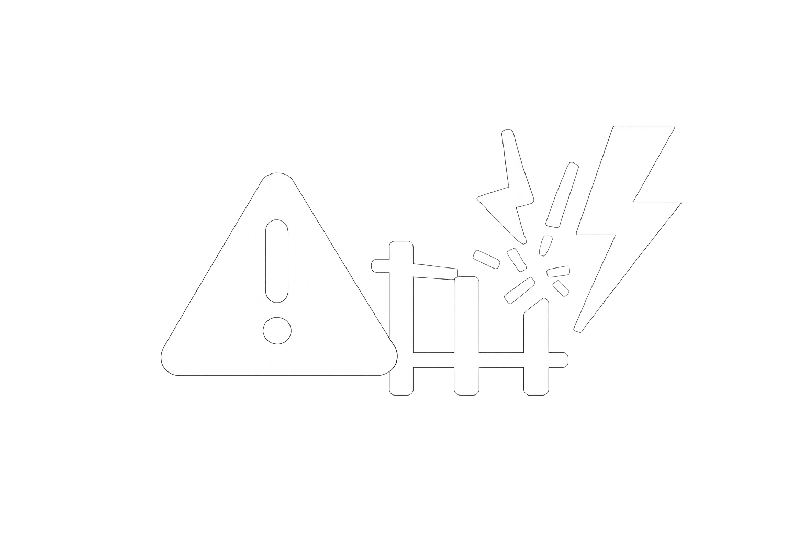

<p align="center">
  
</p>

# 🚂 Track Error Detection System
Real-time Railway Track Error Detection using YOLOv8 for Indian Railways


## 📋 Overview

Automated track defect detection system for Indian Railways using computer vision. Detects critical track errors in real-time with severity classification (Simple, Moderate, Severe).

### Features
- ✅ Real-time detection with live camera feed
- ✅ Severity classification (Simple/Moderate/Severe)
- ✅ Optimized for Raspberry Pi deployment
- ✅ Color-coded bounding boxes (Green/Orange/Red)
- ✅ Confidence scoring for each detection
- ✅ Multiple model sizes (Nano/Small/Medium/Large)

---

## 🔍 Track Error Classes Detected

| Class | Severity | Description |
|-------|----------|-------------|
| **Track Crack** | Severe | Visible cracks in rail tracks |
| **Missing Bolt** | Simple | Missing or loose bolts on rail joints |
| **Ballast Issue** | Moderate | Degraded or missing ballast stones |
| **Broken Sleeper** | Severe | Damaged or missing sleepers |
| **Gauge Error** | Severe | Incorrect track width/alignment |
| **Fishplate Issue** | Moderate | Damaged rail joint plates |
| **Crushed Stone** | Simple | Damaged ballast stones |

---

## 🚀 Quick Start

### 1. Setup Environment

```bash
# Navigate to project directory
cd "Track Error Detection"

# Activate virtual environment
.\venv\Scripts\Activate  # Windows
# or
source venv/bin/activate  # Linux/WSL

# Install dependencies
pip install -r requirements.txt
```

### 2. Dataset Setup

#### Option A: Use Public Dataset

Recommended datasets:
- [Railway Track Anomaly Dataset](https://www.kaggle.com/datasets/search?q=railway+track)
- [Infrastructure Anomaly Detection](https://github.com/topics/railway-detection)
- [CIFAR-10 with train transformations](https://www.cs.toronto.edu/~kriz/cifar.html)

#### Option B: Collect Your Own Data

1. **Capture Images**:
   - Use mobile phone or camera at Indian railway tracks
   - Capture various angles and lighting conditions
   - Include Simple, Moderate, and Severe defects

2. **Organize Data**:
   ```
   data/raw/
   ├── simple/
   │   ├── missing_bolt_001.jpg
   │   └── crushed_stone_002.jpg
   ├── moderate/
   │   ├── ballast_issue_001.jpg
   │   └── fishplate_001.jpg
   └── severe/
       ├── track_crack_001.jpg
       └── broken_sleeper_001.jpg
   ```

3. **Prepare Dataset**:
   ```bash
   python scripts/prepare_dataset.py
   python scripts/create_data_yaml.py
   ```

### 3. Train Model

```bash
# Train with nano model (optimal for Raspberry Pi)
python training/train.py --model nano

# Train with larger model (better accuracy, slower)
python training/train.py --model small
```

**Training Output**:
- Model saved in `models/track_error_model/`
- Best weights: `models/track_error_model/weights/best.pt`
- ONNX export for Pi: `models/track_error_model/weights/best.onnx`

### 4. Run Real-Time Detection

#### **Option A: GUI Application (Recommended)**

**Windows:**
```bash
# Double-click run_gui.bat
# OR run in terminal:
venv\Scripts\python.exe inference\detect_gui.py
```

**Linux/Mac:**
```bash
python inference/detect_gui.py
```

**Features:**
- 🖥️ Modern graphical interface
- 📊 Real-time FPS and detection stats
- 🎨 Color-coded severity indicators
- 🎛️ Camera selection and controls
- ▶️ Start/Stop buttons

#### **Option B: Command Line**

```bash
# Basic detection
python inference/detect_realtime.py

# With specific model
python inference/detect_realtime.py --model models/track_error_model/weights/best.pt

# Record detections
python inference/detect_realtime.py --record

# Save annotated frames
python inference/detect_realtime.py --save-annotations
```

---

## 🥧 Raspberry Pi Deployment

### Installation on Raspberry Pi

```bash
# Install dependencies
sudo apt-get update
sudo apt-get install -y python3-pip python3-venv
sudo apt-get install -y libopencv-dev python3-opencv
sudo apt-get install -y libatlas-base-dev libopenblas-dev

# Create venv
python3.11 -m venv venv
source venv/bin/activate

# Install optimized packages
pip install ultralytics opencv-python-headless onnxruntime

# OR use TensorFlow Lite
pip install tensorflow-lite-runtime
```

### Pi-Specific Configuration

Edit `config.yaml`:
```yaml
pi_mode: True
pi_img_size: 416  # Smaller for better FPS
pi_threads: 4
pi_confidence: 0.5
```

### Run on Pi

```bash
# Train on desktop/cloud, export ONNX
python training/train.py --model nano

# Copy ONNX model to Pi
scp models/track_error_model/weights/best.onnx pi@raspberrypi:/home/pi/track_detection/

# Run inference on Pi
python inference/detect_realtime.py --model best.onnx
```

### Expected Performance on Pi

| Hardware | Model Size | FPS | Resolution |
|----------|------------|-----|------------|
| Raspberry Pi 4 | YOLOv8-nano | 8-12 FPS | 640x480 |
| Raspberry Pi 5 | YOLOv8-nano | 15-20 FPS | 640x480 |
| Raspberry Pi 4 + Coral USB | YOLOv8-nano | 25-30 FPS | 1280x720 |

---

## 📊 Model Performance

### Training Metrics

- **mAP50**: Mean Average Precision at IoU=0.5
- **mAP50-95**: Mean Average Precision at IoU=0.5:0.95
- **F1 Score**: Harmonic mean of precision and recall

### Detection Speed

| Platform | Model | FPS | Latency |
|----------|-------|-----|---------|
| Desktop (RTX 3080) | YOLOv8n | 45+ | ~22ms |
| Desktop (CPU) | YOLOv8n | 12-15 | ~70ms |
| Raspberry Pi 4 | YOLOv8n | 8-12 | ~100ms |
| Raspberry Pi 5 | YOLOv8n | 15-20 | ~60ms |

---

## 📁 Project Structure

```
Track Error Detection/
├── data/
│   ├── raw/                    # Your raw images
│   ├── dataset/                # Organized dataset
│   │   ├── train/
│   │   ├── valid/
│   │   └── test/
│   └── annotations/           # YOLO labels
├── models/                     # Trained models
├── checkpoints/                # Training checkpoints
├── training/
│   ├── train.py               # Training script
│   └── config.yaml            # Model config
├── inference/
│   ├── detect_realtime.py     # Real-time detection
│   └── camera_utils.py        # Camera utilities
├── scripts/
│   ├── prepare_dataset.py      # Dataset organizer
│   ├── create_data_yaml.py    # YOLO config generator
│   └── export_model.py        # Model exporter
├── utils/                      # Helper functions
├── venv/                       # Python virtual environment
├── requirements.txt            # Dependencies
└── README.md                   # This file
```

---

## 🔧 Configuration

Edit `config.yaml` for custom settings:

```yaml
# Model settings
model: 'yolov8n.pt'
img_size: 640
batch_size: 16
epochs: 100

# Detection settings
confidence_threshold: 0.45
iou_threshold: 0.5

# Camera settings
camera:
  device_id: 0
  width: 1280
  height: 720
  fps: 30

# Pi optimization
pi_mode: False
pi_img_size: 416
```

---

## 📚 Dataset Sources

### Public Datasets
1. **Kaggle Railway Datasets**
   - Search: "railway track defect"
   - Links: Various datasets available

2. **Research Papers**
   - Look for papers on railway infrastructure monitoring
   - Many authors provide datasets

3. **Indian Railways Resources**
   - Contact RDSO (Research Designs and Standards Organisation)
   - Check Railway Ministry reports

### Synthetic Data Generation
Use augmentation libraries to expand dataset:
- Albumentations (already in requirements.txt)
- Increase dataset 10x with transformations

---

## 🛠️ Troubleshooting

### Camera Not Working
```bash
# Test camera
python -c "import cv2; cap = cv2.VideoCapture(0); print(cap.isOpened())"

# Check permissions (Linux)
sudo usermod -a -G video $USER
```

### Low FPS on Pi
- Use YOLOv8-nano model
- Reduce image size to 416x416
- Enable quantization
- Close other processes

### Model Not Detecting
- Check confidence threshold
- Verify dataset quality
- Train for more epochs
- Use data augmentation

---

## 📝 Annotation Guide

### Using LabelImg for Manual Annotation

```bash
# Install LabelImg
pip install labelImg

# Run LabelImg
labelImg

# Annotate your images in YOLO format
# Save annotations as .txt files
```

### Annotation Format (YOLO)
```
class_id center_x center_y width height
```
All coordinates normalized to [0, 1]

---

## 🤝 Contributing

Contributions welcome! Areas to improve:
- [ ] Add more track error classes
- [ ] Optimize for TensorFlow Lite
- [ ] Add cloud deployment options
- [ ] Create web dashboard
- [ ] Add video analysis mode

---

## 📄 License

MIT License - Feel free to use for your railway monitoring projects!

---

## 👥 Contact

For issues, questions, or dataset sharing:
- Open an issue on GitHub
- Email: your-email@example.com

---

## 🙏 Acknowledgments

- Ultralytics for YOLOv8
- OpenCV community
- Indian Railways for infrastructure
- Open source computer vision community

---

**Made with ❤️ for Indian Railways Safety**

